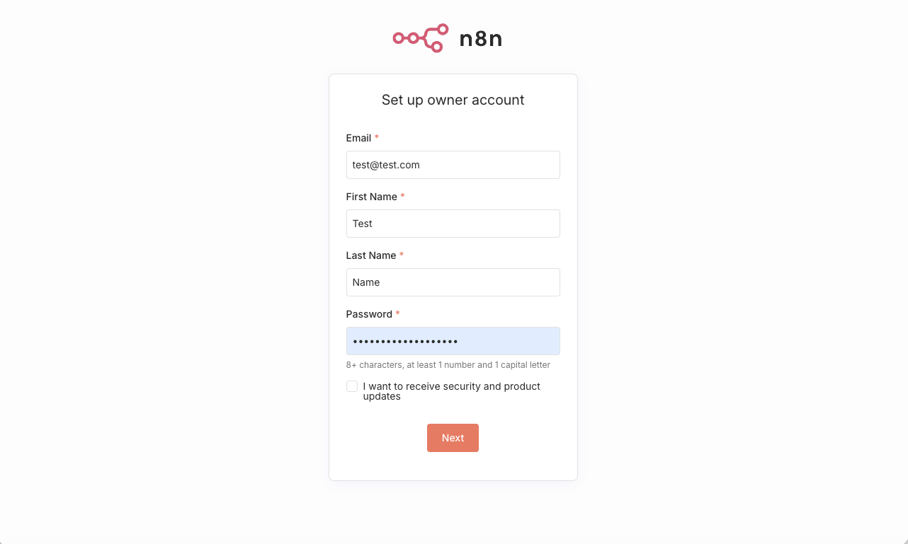
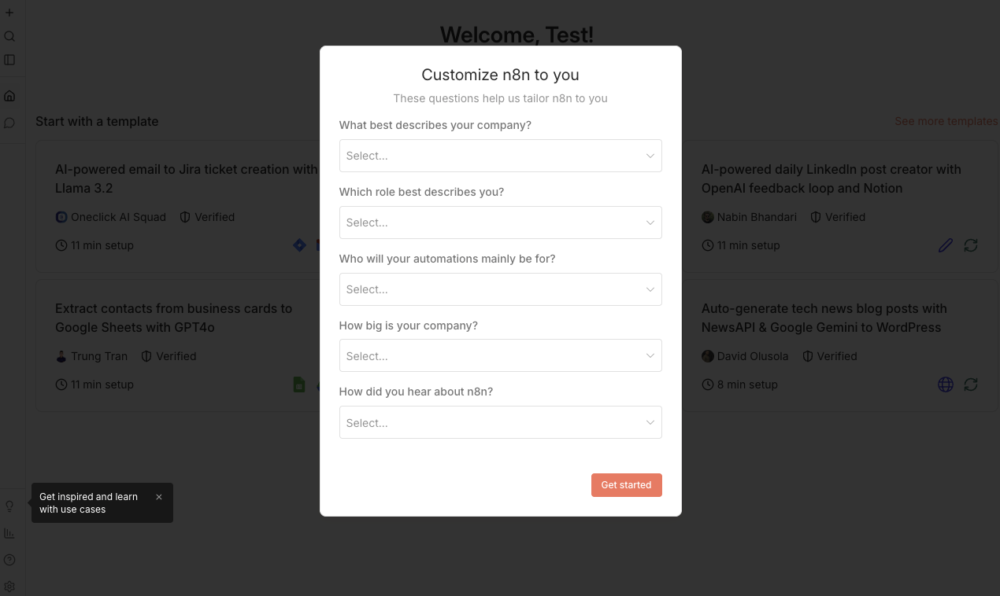
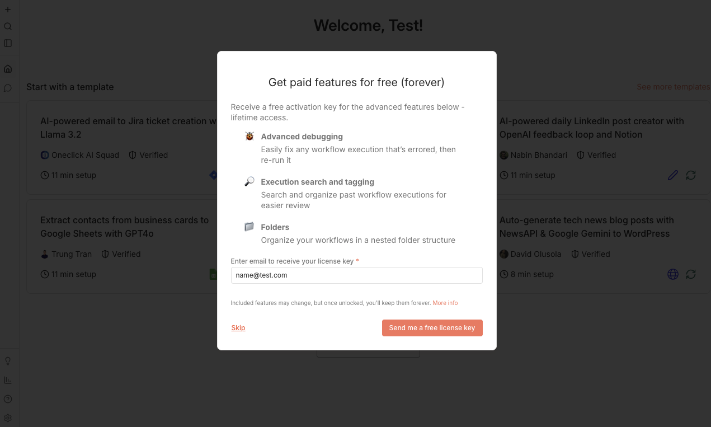
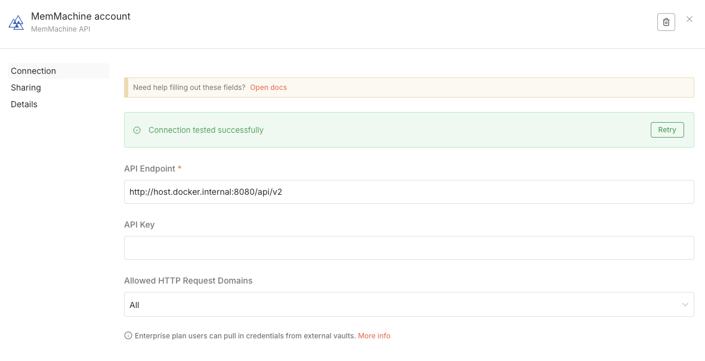

The MemMachine integration for **n8n** allows you to build sophisticated AI agents that remember users across sessions. By using the MemMachine community nodes, you can store interactions, retrieve deep context, and trace memory operations directly within your automation canvas.

## Overview

This integration provides two specialized nodes:
* **MemMachine Manager:** Store messages and "Enrich" your agent prompts with semantic context.
* **MemMachine AI Memory:** A native memory node that plugs directly into n8n's **AI Agent** node.

## Start n8n

To start a simple n8n container run the upstream docker container as described in the official docs: 

```bash
docker run -it --rm \
  --name n8n \
  -p 5678:5678 \
  -e GENERIC_TIMEZONE="Europe/Berlin" \
  -e TZ="Europe/Berlin" \
  -e N8N_ENFORCE_SETTINGS_FILE_PERMISSIONS=true \
  -e N8N_RUNNERS_ENABLED=true \
  -v n8n_data:/home/node/.n8n \
  docker.n8n.io/n8nio/n8n
```

### With Tracing 

If you want to visualize the memory interactions you might want to use the `docker-compose` file in the github repository.

```bash
wget -q https://raw.githubusercontent.com/MemMachine/n8n-nodes-memmachine/refs/heads/main/docker-compose.yml
docker-compose up -d
```

Either way, after one of the commands finished, you are able to open your n8n instance.


<Steps>
  <Step title="First Login">
    Open [localhost:5678/](http://localhost:5678/):
    1. Fill out a sign-up form.
    
    2. Skip the customization and click `Get Started`.

    

    3. Skip the offer page with `Skip`.

    
  </Step>
  <Step title="Install the Community Node">
    If you are using a self-hosted n8n instance:
    1. Navigate to **Settings > Community Nodes**.
    2. Click **Install a community node**.

    

    3. Enter the package name: 
    ```
    @memmachine/n8n-nodes-memmachine
    ```
    4. Acknowledge the risk and click **Install**.

    
  </Step>

  <Step title="Configure Your Credentials">
    When you add a MemMachine node, you will be prompted to create credentials. You will need your **API Key** from the MemMachine Dashboard.
  </Step>
</Steps>

## MemMachine Manager Node

The Manager node is used for manual memory operations at any point in your workflow.

### Connect MemMachine

To use the node you'll need to configure a connection. In case you are running MemMachine on the same machine as a docker container use  this endpoint:
```
http://host.docker.internal:8080/v2/api
```



### Action: Store a message
Saves a specific content string to long-term memory.

| Parameter | Type | Description |
| :--- | :--- | :--- |
| **orgId / projectId** | String | **Required.** Your unique organization and project identifiers. |
| **producer** | String | **Required.** Who created this message (e.g., "Agent" or "User"). |
| **producedFor** | String | **Required.** Intended recipient of the message. |
| **episodeContent**| String | **Required.** The actual message text to store. |
| **episodeType** | Options | `dialog` (default), `summary`, or `observation`. |
| **groupId** | String | Unique group identifier (defaults to `default`). |
| **agentId / userId** | String | **Required.** Identifiers for the specific AI agent and user. |

### Action: Enrich with context
Retrieves historical context to inject into an LLM prompt.

| Parameter | Type | Default | Description |
| :--- | :--- | :--- | :--- |
| **query** | String | - | **Required.** Natural language query for semantic search. |
| **limit** | Number | 50 | Maximum number of memory results to return. |
| **filterBySession**| Boolean | `true` | Restricts results to the current session context. |
| **enableTemplate** | Boolean | `true` | Renders a formatted context string using a template. |
| **contextTemplate**| String | - | Markdown template for formatting (uses system default if empty). |

---

## MemMachine AI Memory Node

Connect this node directly to the **Memory** input of a native n8n **AI Agent** node.

| Parameter | Type | Default | Description |
| :--- | :--- | :--- | :--- |
| **contextWindowLength** | Number | 10 | Max recent messages to include in chat history. |
| **enableMemoryTemplate**| Boolean | `false` | Whether to wrap history in a formatted template. |
| **historyCount** | Number | 5 | Number of episodic memories to include in the template. |
| **shortTermCount** | Number | 10 | Number of short-term memories to include. |

---

## Observability & Tracing

MemMachine nodes support native **OTLP Tracing** for debugging complex agent logic. When enabled, you can visualize memory operations in external tools like Jaeger.


| Parameter | Type | Description |
| :--- | :--- | :--- |
| **tracingEnabled** | Boolean | Set to `true` to enable operation tracing. |
| **traceVerbosity** | Options | `minimal`, `normal`, or `verbose`. |
| **exportToJaeger** | Boolean | If `true`, sends traces to your Jaeger instance. |
| **jaegerOtlpEndpoint**| String | The endpoint URL (e.g., `http://jaeger:4318/v1/traces`). |

<Note>
  **Pro-Tip:** When using the **AI Memory Node**, ensure your `agentId` and `userId` are passed consistently across the workflow to ensure the agent's "recognition" of the user remains persistent.
</Note>